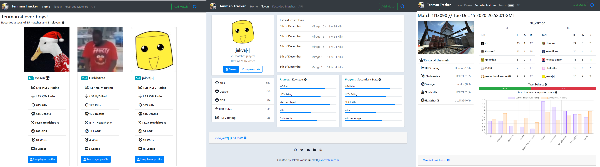

# tenmen-tracker

Python web app for tracking and analyzing match data from CSGO matches played with friends on the scrim service [PopFlash](https://popflash.site/). The [match extracion](/match_extraction) module [scrapes](https://en.wikipedia.org/wiki/Web_scraping) the PopFlash match page and extracts the match data. The [database management](/database_management) module accepts the match data and adds it to a MySQL database. The ``__init__.py`` is the [Flask](https://flask.palletsprojects.com/en/1.1.x/) based Python backend interacting with the database and webscraper to present the stored matches and match data to the website. It also allows users to add their matches to be included as part of the total statistics.

A live demo of the website can be found [here](http://jakobvahlin.com/tenman)



## Table of Contents

- [Hosting your own Web App](#hosting-your-own-web-app)
    - [Quickstart](#quickstart)
- [The match extraction module](#the-match-exctraction-module)    
- [The database management module](#the-database-management-module)
## Hosting your own Web App

### Quickstart
If you are familiar with Python based web development and already have a MySQL database and Apache2 (or similar) on your server, clone this project into the folder hosting your web app. You will have to alter the login details of the database management module to match your own database. 


### Running on Ubuntu/Linux-based host system
There are several ways to host (Python based) web applications. If you are new to the field, I can recommend a [Digital Ocean droplet](https://www.digitalocean.com/products/droplets/) for hosting your web app. They will set you back $5 USD a month, however offer loads of great tutorial for beginners. To deploy the tenman-tracker Flask app, follow [this tutorial](https://www.digitalocean.com/community/tutorials/how-to-deploy-a-flask-application-on-an-ubuntu-vps). Navigate to the folder hosting your web app

```~$ cd /var/www/<FlaskApp>/<FlaskApp>```

and clone the git repository into the folder

``` ~$ git clone git@github.com:jakvah/tenmen-tracker.git```

## The match exctraction module

## The database management module

